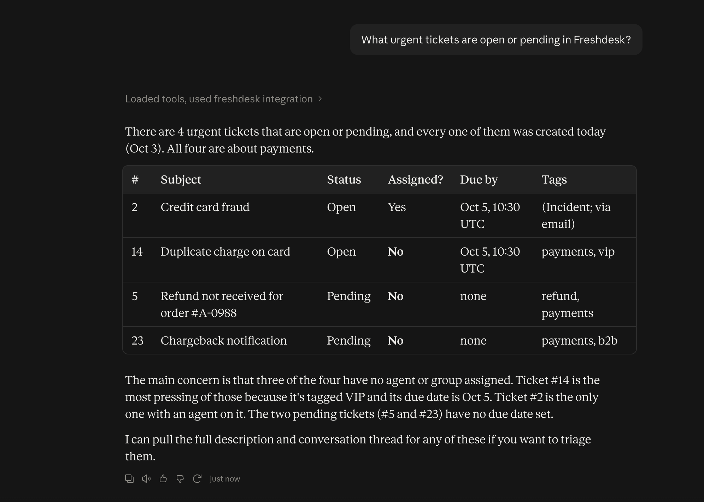
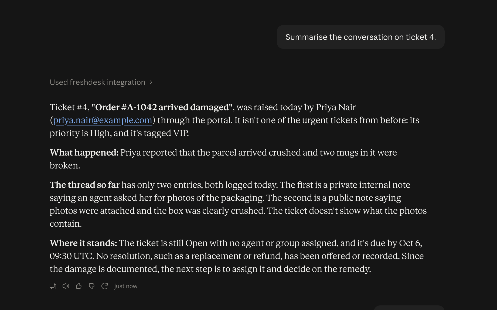
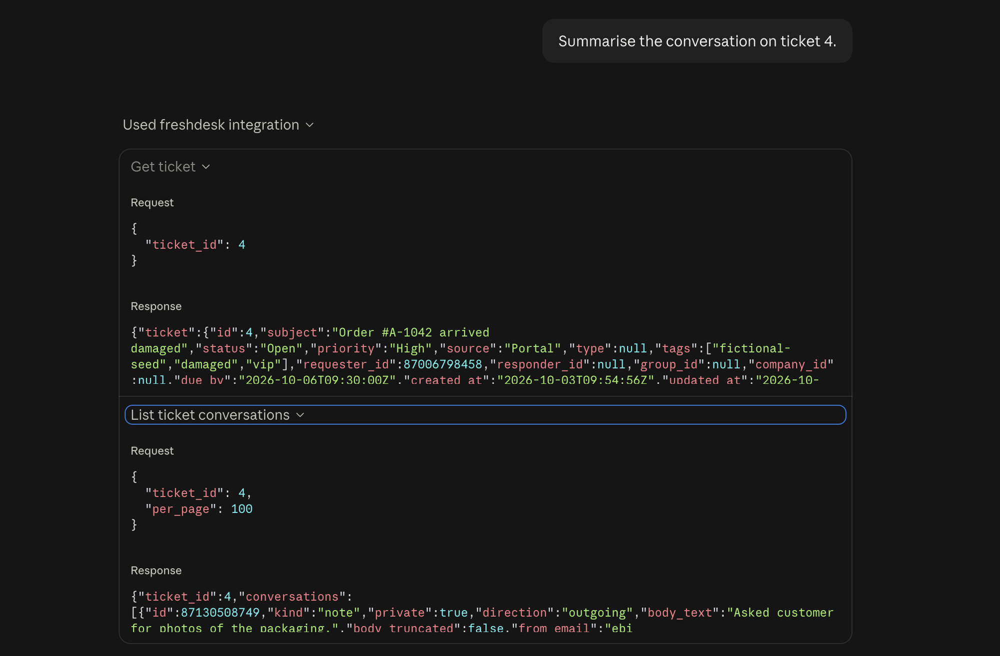
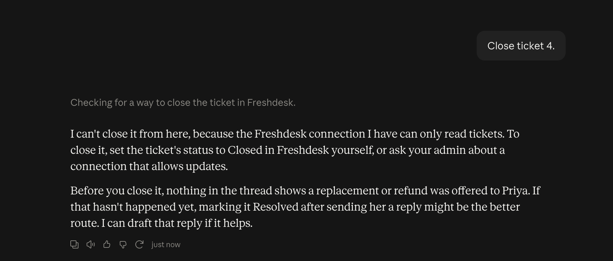

# Freshdesk MCP connector

A private, **read-only** connector that lets an Agent Studio agent (or any MCP host) read Freshdesk tickets, ticket conversations and contacts.

- **6 MCP tools:** `list_tickets`, `get_ticket`, `list_ticket_conversations`, `search_tickets`, `get_contact`, `search_contacts`. See [docs/TOOLS.md](docs/TOOLS.md).
- **Two transports:** stdio for local MCP hosts, and Streamable HTTP with bearer-token auth for hosted platforms that connect by URL.
- **API-key authentication** to Freshdesk, with domain allow-listing and no redirect following.
- **Rate-limit handling:** reads Freshdesk's rate-limit headers, slows down before the limit, pauses all requests for `Retry-After` after a 429, and backs off on errors.
- **What the agent can and cannot do:** [docs/CAPABILITIES.md](docs/CAPABILITIES.md)
- **Verified against a live Freshdesk account:** [docs/LIVE_RUN.md](docs/LIVE_RUN.md), with an [agent demo](#demo-claude-desktop-using-the-connector) below

## Demo: Claude Desktop using the connector

An agent (Claude Desktop, connected over stdio) answering questions about a live Freshdesk trial filled with fictional data:

**"What urgent tickets are open or pending?"** The agent calls `search_tickets`, and spots that 3 of the 4 are unassigned.



**"Summarise the conversation on ticket 4."** The agent combines `get_ticket` and `list_ticket_conversations`, separating the private agent note from the customer's reply.



The tool calls behind that answer, with structured inputs and the connector's labelled JSON results:



**"Close ticket 4."** The connector is read-only, so the agent explains it can't, and suggests a next step.



## Requirements

- Node.js 22.12 or newer
- For live use: a Freshdesk account (a free trial works) and its API key

## Quick start (no Freshdesk account needed)

```bash
npm install
npm test          # 155 offline tests; Freshdesk is mocked
npm run build
```

## Testing

| Level | Command | Needs |
|---|---|---|
| Unit + integration | `npm test` | Nothing. Freshdesk is mocked with msw, and MCP is exercised through real SDK clients over in-memory, stdio and HTTP transports. |
| Type safety | `npm run typecheck` | Nothing |
| Live, stdio | `npm run seed` then `npm run smoke` | A Freshdesk account in `.env` |
| Live, HTTP | `npm run smoke -- --http` | A Freshdesk account in `.env` |
| Interactive | `npm run inspect` | A Freshdesk account in your shell environment |

The same checks run on every push via GitHub Actions ([.github/workflows/ci.yml](.github/workflows/ci.yml)) on Node 22 and 24.

### Configure credentials for live testing

```bash
cp .env.example .env
# edit .env:
#   FRESHDESK_DOMAIN=yourcompany        (or yourcompany.freshdesk.com)
#   FRESHDESK_API_KEY=...               (Freshdesk → profile picture → Profile settings → View API key)
```

`.env` is git-ignored. Never commit a real key.

> **API key shows as "disabled"?** Newer Freshdesk accounts turn off API-key access by default. An admin must enable it: Profile settings → the **Agent Settings** link in the "Your API Key" box (or Admin → Agent settings) → turn on API key access, then reload Profile settings to see **View API key**. In production, enable it only for a dedicated read-only agent.

Then:

```bash
npm run seed      # creates 10 fictional contacts + 20 fictional tickets tagged "fictional-seed" (skips if already seeded)
npm run smoke     # starts the MCP server and runs 11 checks through a real MCP client
```

- Freshdesk's search index takes a minute or two to pick up new records. `smoke` waits for the index where it needs to.
- `seed` is a development helper and the project's only code that writes to Freshdesk. Run it only against a trial or sandbox account. Freshdesk may send its usual automatic emails to the fictional `example.com` requesters; those addresses can't receive mail.
- `npm run inspect` opens the MCP Inspector against the built server. It reads `FRESHDESK_*` from your shell, so export them first, for example with `set -a; source .env; set +a`.

## Connecting an agent

### Local MCP hosts (stdio)

Register the server in Claude Desktop, Cursor or any MCP host that launches local servers:

```json
{
  "mcpServers": {
    "freshdesk": {
      "command": "node",
      "args": ["/absolute/path/to/freshdesk-mcp-connector/dist/index.js"],
      "env": {
        "FRESHDESK_DOMAIN": "yourcompany",
        "FRESHDESK_API_KEY": "your-api-key"
      }
    }
  }
}
```

### Hosted platforms such as Agent Studio (HTTP)

Platforms that connect to MCP servers by URL need the HTTP transport:

```bash
MCP_TRANSPORT=http MCP_HTTP_TOKEN="$(openssl rand -hex 24)" PORT=3000 HOST=0.0.0.0 npm start
# → listening on http://0.0.0.0:3000/mcp
```

Register `https://<your-host>/mcp` as the MCP server URL, with the header `Authorization: Bearer <MCP_HTTP_TOKEN>`.

- The server refuses to start in HTTP mode without a token of at least 16 characters. It listens on `127.0.0.1` unless `HOST` is set.
- Serve it behind TLS (a reverse proxy or the platform's ingress); the server itself speaks plain HTTP.
- `GET /healthz` is an unauthenticated liveness check.
- Requests are handled statelessly and share one Freshdesk client, so all callers draw on one rate-limit budget.

Example agent prompts: *"What urgent tickets are still open?"*, *"Summarise the conversation on ticket 4"*, *"Has priya.nair@example.com raised anything else recently?"*

### Settings

| Variable | Default | Meaning |
|---|---|---|
| `FRESHDESK_DOMAIN` | required | Freshdesk subdomain (`acme` or `acme.freshdesk.com`) |
| `FRESHDESK_API_KEY` | required | Freshdesk API key |
| `FRESHDESK_TIMEOUT_MS` | 15000 | Per-request timeout (covers the whole response body) |
| `FRESHDESK_MAX_RETRIES` | 3 | Retries for 429 / 5xx / network errors / timeouts |
| `FRESHDESK_MAX_RETRY_WAIT_S` | 30 | Longest `Retry-After` the server will wait before returning `RateLimitedError` instead |
| `FRESHDESK_MAX_CONCURRENCY` | 2 | Max in-flight Freshdesk requests |
| `MCP_TRANSPORT` | `stdio` | `stdio` or `http` |
| `MCP_HTTP_TOKEN` | required for HTTP | Bearer token callers must send (≥ 16 characters) |
| `HOST` / `PORT` | `127.0.0.1` / `3000` | HTTP listen address |

## Project layout

```
src/
  index.ts         entry point: picks stdio or HTTP
  http.ts          Streamable HTTP server: bearer auth, body limits, health check
  server.ts        MCP server + instructions
  tools/           tool definitions (tickets, contacts) and result/error formatting
  client.ts        Freshdesk HTTP client: auth, retries, pagination, error mapping
  ratelimit.ts     rate-limit tracking, pacing, 429 cooldown, concurrency cap
  query.ts         structured criteria → Freshdesk search query
  mappers.ts       Freshdesk records → agent-friendly shapes
  schemas.ts       zod output schemas (also published as MCP output schemas)
  config.ts        environment configuration
scripts/           seed, smoke (stdio + HTTP), tool-doc generator
tests/             vitest + msw (offline)
docs/              TOOLS.md (generated), CAPABILITIES.md, LIVE_RUN.md
.github/workflows/ CI: typecheck, tests, build on Node 22 and 24
```

## Development

| Command | Purpose |
|---|---|
| `npm test` | All offline tests |
| `npm run typecheck` | TypeScript strict check |
| `npm run docs:tools` | Regenerate `docs/TOOLS.md` after changing a tool (a test fails if it is stale) |
| `npm run dev` | Run the server from source |

## Assumptions and limitations

- Read-only by design: the brief asks for reading tickets, and read-only is the safe default for an agent. Write tools are listed as a next step in CAPABILITIES.md.
- Freshdesk's REST API supports only API-key authentication. A personal key acts as the agent who owns it, so use a dedicated read-only agent account in production.
- One Freshdesk account per server process. In HTTP mode, all callers share one bearer token and one Freshdesk key. Per-tenant credentials and OAuth are listed as next steps.
- Search is limited by Freshdesk to 300 results per query, and newly created tickets can take a short while to appear in search results.
- `list_tickets` only covers the last 30 days unless `updated_since` is set.
- No caching.

See [docs/CAPABILITIES.md](docs/CAPABILITIES.md) for the full list and the recommended long-term fixes.
